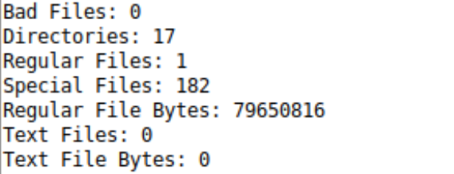

# Operating-Systems

### This repository holds projects focussing around the Ubuntu O.S.   All projects in this repo were build on *Ubuntu 22.04.03*   Projects in this repository focus on different aspect of an operating systems system calls: `semaphores`, `threads`, `exec`, `fork`  `multi-threading`, `synchronization`, `critical reigons`, `mutex`, `barriers`, and `message passing`

## Projects:

## [Distributed John Conway's Game of Life](https://github.com/evlutz/Operating-Systems/tree/main/Distributed_Game_of_Life)

- `Synchronization` through `message passing`
- Optimized preformance with `multi-threading`
- Implemented `semaphores` for shared data `critical reigons`

## [Multiserver](https://github.com/evlutz/Operating-Systems/tree/main/Server%20Request%20Handler)

- `Serial and Multi-Threaded` architecture avalible
- Replicates a server which all thread at some point havee to access the critical reigon
- Implements `mutual exclusion` in the critical reigon
- Utilizes `iNode` information but also checks specifically for text files

